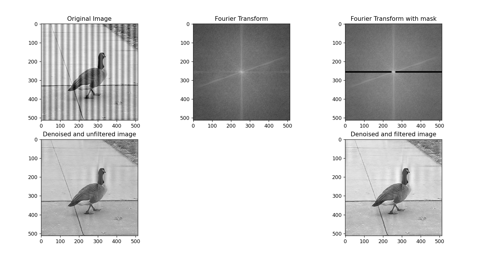
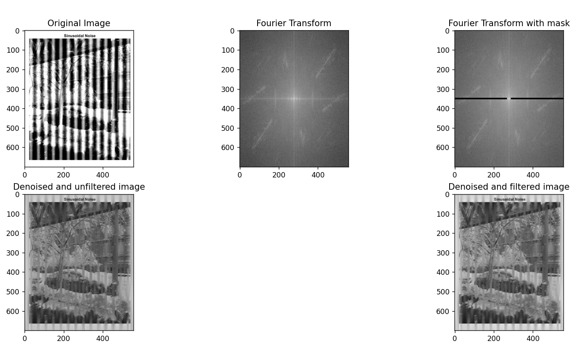

<h1>Image Noise Remover</h1>
<h4>Python project which breaks image information into its corresponding frequency signals and remove periodic noise present.</h4>

<strong>Tech Stack & Concepts used - </strong>
1) Python
2) OpenCV
3) Fourier Transformation of image
4) Butterworth low-pass filters

Demo

<h4>Demo - 1</h4>

<h4>Demo - 2</h4>
